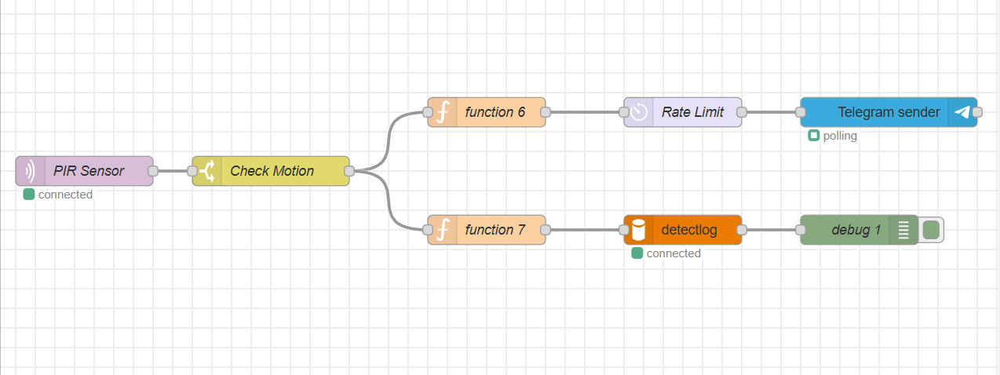
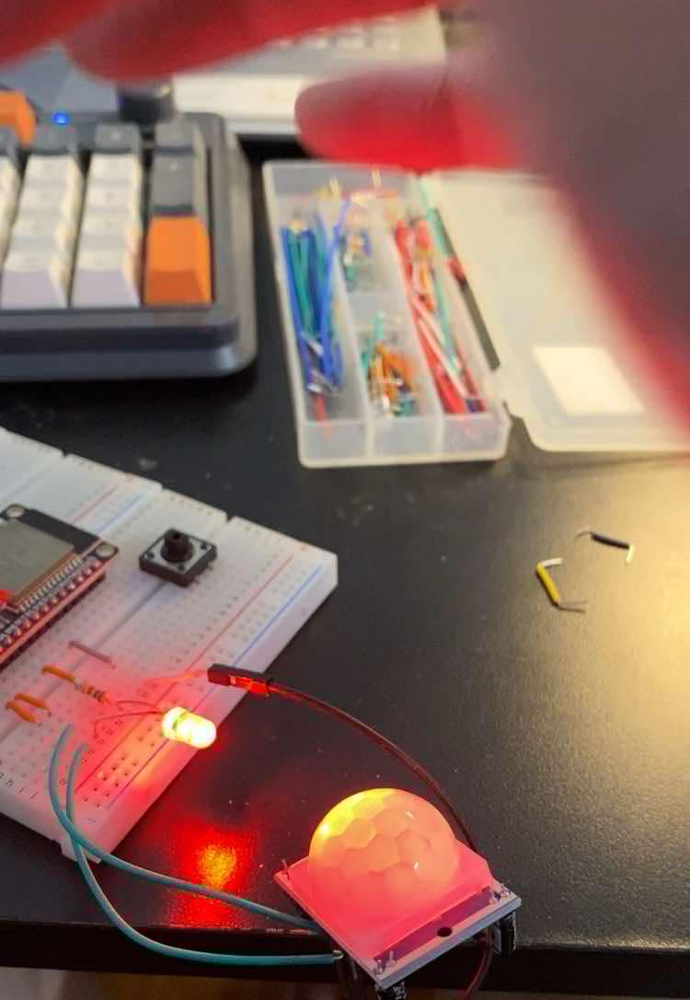
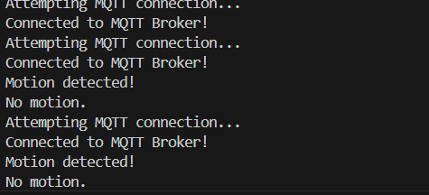
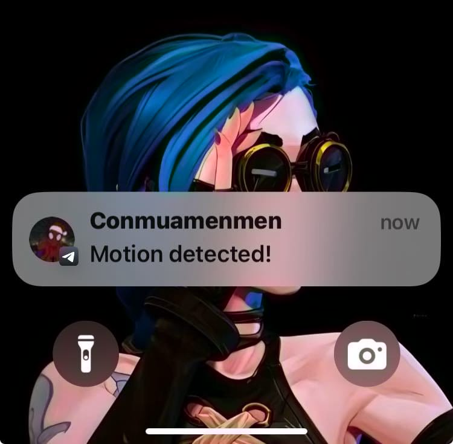
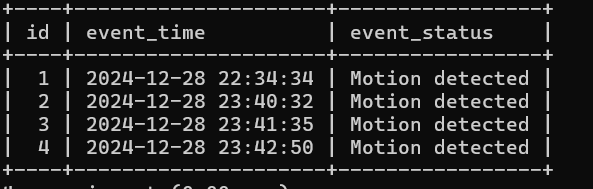

# Hệ Thống Cảnh Báo Phát Hiện Chuyển Động Qua Tin Nhắn Tự Động 

## Lời Cảm Ơn

Em xin gửi lời cảm ơn chân thành và sâu sắc nhất đến thầy vì sự tận tâm và nỗ lực trong việc giảng dạy chúng em trong suốt kỳ học vừa qua. Những kiến thức mà thầy đã truyền đạt không chỉ giúp em nâng cao năng lực chuyên môn mà còn mở rộng tư duy, rèn luyện cách tiếp cận vấn đề một cách hiệu quả hơn.
Em chúc thầy thật nhiều sức khỏe, niềm vui, và thành công trong sự nghiệp giảng dạy.
Trân trọng.

## Giới Thiệu

Trong các ứng dụng IoT hiện đại, việc phát hiện chuyển động và gửi thông báo tức thời là một tính năng quan trọng, đặc biệt trong lĩnh vực an ninh và giám sát. Dự án này phù hợp với những khu vực cần bảo mật cao ít người qua lại hay hộ gia đình vắng nhà nhiều ngày, không thể check camera 24/24. Dự án trình bày cách xây dựng một hệ thống cảnh báo phát hiện chuyển động sử dụng vi điều khiển ESP32, cảm biến chuyển động PIR và Node-RED. Hệ thống sẽ gửi tin nhắn Telegram để thông báo khi phát hiện chuyển động.

## Mục Tiêu

- Phát hiện chuyển động sử dụng cảm biến PIR kết nối với ESP32.
- Gửi cảnh báo chuyển động qua tin nhắn Telegram.
- Lưu trữ dữ liệu vào database

## Vật Tư Sử Dụng

- Bo ESP32 Dev Board
- Cảm biến chuyển động PIR (HC-SR501)
- Breadboard và dây nối
- Node-RED 
- Bot Telegram để gửi thông báo
- Database MySQL

## Sơ Đồ Hệ Thống
Sơ đồ sau minh họa hệ thống:

```
Cảm biến PIR → ESP32 → MQTT Broker → Node-RED → Telegram
MQTT Broker → MySQL
```

## Sơ Đồ Kết Nối
| **Chân Cảm Biến PIR** | **Chân ESP32** |
|-----------------------|----------------|
| VCC                   | 3.3V           |
| GND                   | GND            |
| OUT                   | GPIO5          |

## Các Bước Triển Khai

### 1. Cấu Hình ESP32

1. Kết nối cảm biến PIR với ESP32 theo sơ đồ kết nối.
2. Sử dụng mã nguồn ESP32 để gửi sự kiện chuyển động đến MQTT broker.

### 2. Thiết Lập Node-RED

1. Cài đặt các node cần thiết như Telegram và MQTT, MySQL.
2. Cấu hình topic MQTT và Token của Bot Telegram trong luồng Node-RED.

### 3. Kiểm Tra và Debug

1. Mở tab Debug trong Node-RED để theo dõi các tin nhắn MQTT.
2. Kích hoạt cảm biến PIR và kiểm tra xem có nhận được thông báo Telegram không.

## Luồng Node-RED
### Tổng Quan Luồng

- **Node MQTT Input**: Lắng nghe topic chuyển động (`home/motion`).
- **Node Switch**: Lọc các tin nhắn chỉ xử lý sự kiện "Motion detected".
- **Node Function 6**: Cấu hình chatID, tin nhắn để gửi tới node telegram
- **Node Delay**: Giới hạn tần suất gửi thông báo, tối đa một tin nhắn mỗi 5 giây.
- **Node Telegram Sender**: Gửi thông báo đến người dùng qua Telegram.
- **Node Function 7**: Cấu hình kiểu dữ liệu để ghi vào database

### Ảnh Chụp 


**flow** 


**Led phát sáng khi phát hiện chuyển động** 


**Gửi thông báo tới MQTT** 


**MQTT gửi tin nhắn thông báo qua telegram** 


**Table history trên mysql** 

## Kết Quả Dự Án

1. Hệ thống đã phát hiện chuyển động và gửi thông báo Telegram thành công.
2. Tin nhắn không bị gửi trùng lặp nhờ cấu hình giới hạn tần suất.
3. Hệ thống hoạt động ổn định và có độ trễ thấp.
4. Lưu trữ thông tin trên database.

## Cải Tiến Trong Tương Lai

- Thêm module camera để chụp hình khi phát hiện chuyển động.
- Mở rộng hệ thống để hỗ trợ nhiều cảm biến chuyển động.

## Kết Luận

Dự án này cung cấp một ví dụ thực tế về việc tích hợp các công nghệ IoT để xây dựng hệ thống phát hiện chuyển động và thông báo. Bằng cách sử dụng ESP32, MQTT và Node-RED, chúng ta đã tạo ra một cơ chế cảnh báo thời gian thực mạnh mẽ, có thể được mở rộng cho các ứng dụng nâng cao.

---

